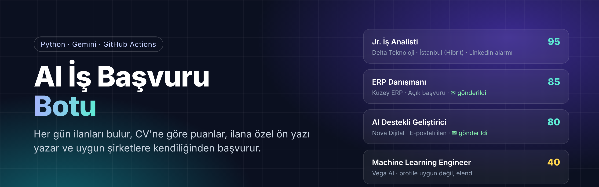
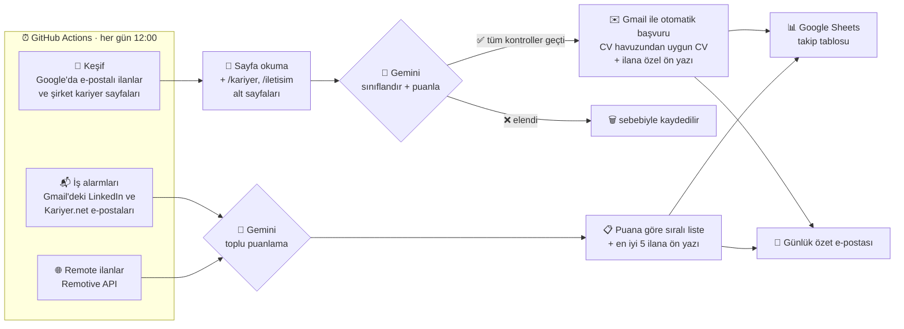
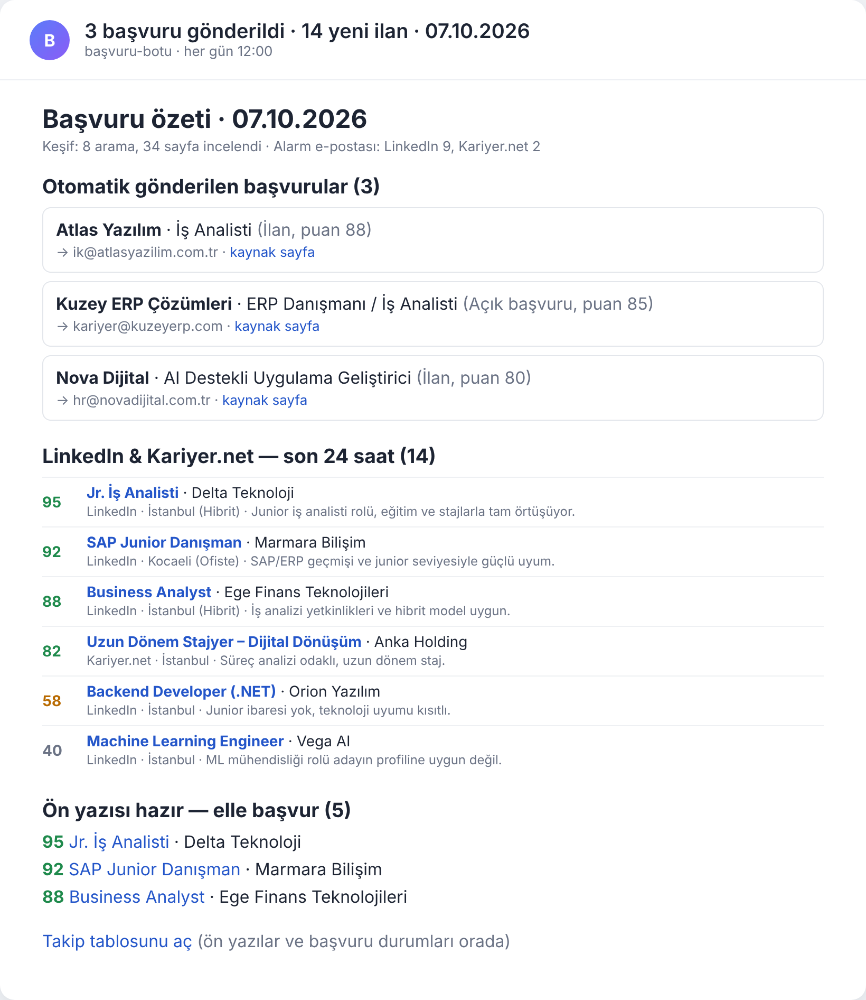
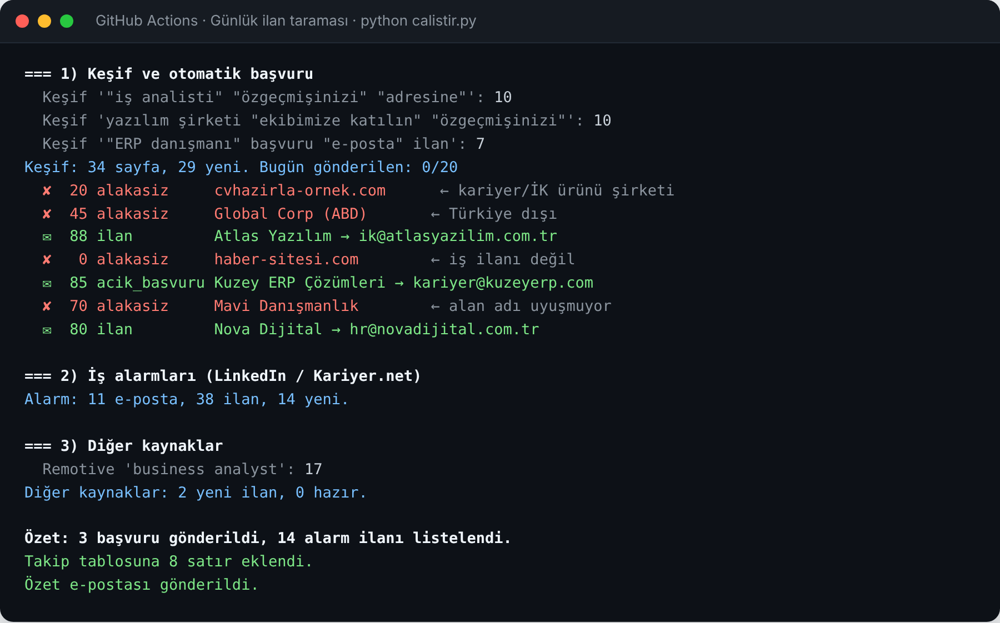
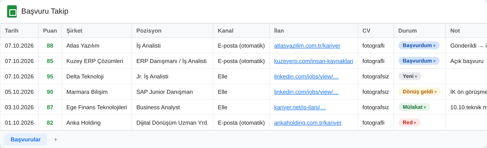

<p align="center">
  
</p>

<p align="center">
  
  
  
  
  
</p>

<p align="center">
  <b>Her gün iş ilanlarını bulan, CV'ye göre puanlayan, ilana özel ön yazı yazan ve uygun şirketlere kendiliğinden başvuran bir otomasyon.</b><br>
  Sunucu ya da açık bir bilgisayar gerektirmez — tamamen GitHub Actions üzerinde çalışır.
</p>

---

## Neden?

İş ararken en çok zaman alan iki şey: **ilan bulmak** ve **her ilana ayrı ön yazı hazırlamak**. Üstelik birçok şirket ilanını LinkedIn'e değil, kendi kariyer sayfasına koyuyor ya da "CV'nizi ik@… adresine gönderin" diye bir satırla geçiyor — bunları elle takip etmek neredeyse imkânsız.

Bu bot, kendi iş aramam için geliştirdiğim bir sistem: her gün öğlen çalışıyor, bu görünmeyen ilanları buluyor, profilime uygun olanlara başvuruyor ve LinkedIn/Kariyer.net'teki yeni ilanları puana göre sıralayıp bana e-postayla gönderiyor.

> İlk iki haftalık kullanımda **370+ ilan** ve **500+ şirket sayfası** analiz edildi.

## Nasıl çalışır?



Bot üç kaynaktan beslenir:

| Kaynak | Nasıl bulur | Ne yapar |
|---|---|---|
| **Keşif** | SerpApi ile Google'da `"iş analisti" "özgeçmişinizi" "adresine"` gibi sorgular. 52 sorgu kombinasyonu her gün dönüşümlü çalışır (günde 8 arama). | Uygun şirketlere **otomatik başvurur** |
| **İş alarmları** | LinkedIn ve Kariyer.net'in Gmail'e gönderdiği alarm e-postalarını IMAP ile okur (takip linklerini çözerek gerçek ilan adresine ulaşır). | Puanlar, sıralar, ön yazı hazırlar — başvuru **elle** |
| **Remote ilanlar** | Remotive API | Puanlar, ön yazı hazırlar |

## Ekran görüntüleri

<table>
<tr>
<td width="50%" valign="top">
<b>Günlük özet e-postası</b><br>

</td>
<td width="50%" valign="top">
<b>Çalışma kaydı (GitHub Actions)</b><br>

<br><br>
<b>Google Sheets takip tablosu</b><br>

</td>
</tr>
</table>

<sub>Görsellerdeki şirket ve aday bilgileri kurgusaldır.</sub>

## Başvurmadan önce yapılan kontroller

Otomatik e-posta göndermek hata kaldırmayan bir iş; bu yüzden her başvuru aşağıdaki kapılardan geçer:

| Kontrol | Nerede | Amaç |
|---|---|---|
| **Uydurma yok** | Prompt + doğrulama | Ön yazıda profilde olmayan deneyim/beceri yazılmaz; staj fiilleri ("destekledim") güçlendirilmez |
| **Adres sayfada geçmeli** | Kod | Model sadece sayfada gerçekten bulunan adreslerden birini seçebilir (JSON şemasında `enum`) |
| **Alan adı uyumu** | Kod | `ik@firma.com.tr` ancak `firma.com.tr` sitesinden alınmışsa kabul edilir |
| **Yasaklı adresler** | Kod | `noreply`, satış, muhasebe, üniversite ve kamu (`.edu`, `.gov`) adresleri asla |
| **Rol ve kıdem uyumu** | Gemini | ML mühendisi, senior roller, zorunlu (okul) stajları düşük puan alır |
| **Gerçek şirket, Türkiye'de** | Gemini + kod | Kişisel siteler, yurt dışı şirketler, kariyer/CV/İK hizmeti satan şirketler elenir |
| **İşe alım sinyali** | Kod | Açık başvuru için sayfada "ekibimize katılın", "açık pozisyonlar" gibi bir ifade şart |
| **Tekrar yok** | SQLite | Aynı şirkete 30 gün içinde ikinci kez yazılmaz |
| **Hız sınırı** | Kod | Günde en fazla 20 başvuru, e-postalar arasında bekleme |
| **Kuru mod** | Ayar | `kuru_calisma: true` → hiçbir şey göndermez, sadece taslakları raporlar |

## Teknoloji yığını

| Katman | Kullanılan |
|---|---|
| Dil | Python 3.12 |
| LLM | Google Gemini (`google-genai`, JSON şemalı yapılandırılmış çıktı) |
| Arama | SerpApi (Google Search) · Remotive API |
| E-posta | Gmail SMTP (gönderim) · Gmail IMAP (alarm okuma) |
| Takip | Google Sheets API (service account) |
| Depolama | SQLite (görülen ilanlar, gönderim geçmişi) |
| Zamanlama | GitHub Actions (cron) — veritabanı her çalışmadan sonra repoya commit'lenir |

## Proje yapısı

```
├── calistir.py              # Ana akış: keşif → alarm → diğer kaynaklar → tablo + e-posta
├── profil.ornek.yaml        # Örnek aday profili + tüm ayarlar (kendi profil.yaml'ını buradan oluştur)
├── cv_havuzu/               # Hazır CV PDF'leri (bot CV üretmez, havuzdan ilana uygun olanı seçer)
├── ai/
│   ├── eslestirici.py       # Tek ilan puanlama, CV seçimi, ön yazı + doğrulama
│   ├── kesif_ai.py          # Web sayfası sınıflandırma (ilan / açık başvuru / alakasız)
│   └── toplu_puan.py        # Alarm ilanlarını tek çağrıda toplu puanlama
├── toplayici/
│   ├── kesif.py             # Google araması, sayfa okuma, e-posta çıkarma ve filtreleme
│   ├── alarm.py             # LinkedIn / Kariyer.net alarm e-postası ayrıştırıcı
│   ├── gonderici.py         # CV ekli başvuru e-postası (Gmail SMTP)
│   ├── eposta.py            # Günlük özet e-postası
│   ├── sheets.py            # Google Sheets takip tablosu
│   ├── kaynaklar.py         # Remotive vb. ilan kaynakları
│   └── veritabani.py        # SQLite kayıtları
├── ornek/                   # İnternetsiz test için örnek veriler
└── .github/workflows/gunluk.yml
```

## Hemen dene (internet ve API anahtarı gerekmez)

```bash
git clone https://github.com/ceylanbariss/is-basvuru-botu.git
cd is-basvuru-botu
pip install -r requirements.txt
python calistir.py --sahte
```

`--sahte` modu `ornek/` klasöründeki örnek verilerle tüm akışı çalıştırır, hiçbir şey göndermez ve `cikti/` klasörüne özet e-postasının önizlemesini yazar.

## Kendi hesabında çalıştırma

1. **Repoyu kendi hesabına kopyala** — kişisel profil ve CV ekleyeceğin için **özel (private)** bir repo kullan.
2. **Profilini oluştur:** `profil.ornek.yaml` dosyasını `profil.yaml` olarak kopyala; kişisel bilgilerini, deneyimlerini (etiketleriyle) ve hedef rollerini yaz.
3. **CV'lerini ekle:** PDF'leri `cv_havuzu/` klasörüne koy ve `profil.yaml` içindeki `cv_havuzu` listesini güncelle.
4. **Anahtarları al ve GitHub Secrets'a ekle** (*Settings → Secrets and variables → Actions*):

   | Secret | Nereden |
   |---|---|
   | `GEMINI_API_KEY` | [Google AI Studio](https://aistudio.google.com) |
   | `SERPAPI_KEY` | [SerpApi](https://serpapi.com) (ücretsiz plan: ayda 250 arama) |
   | `GMAIL_ADRES` | Gmail adresin |
   | `GMAIL_UYGULAMA_SIFRESI` | Google Hesabı → [Uygulama şifreleri](https://myaccount.google.com/apppasswords) (2 adımlı doğrulama gerekir) |
   | `GOOGLE_SA_JSON` | Google Cloud'da service account → JSON anahtarının tamamı (Sheets API açık olmalı) |
   | `SHEET_ID` | Takip tablosunun linkindeki kimlik; tabloyu service account e-postasıyla **Düzenleyen** olarak paylaş |

5. **İş alarmlarını kur:** LinkedIn ve Kariyer.net'te hedef rollerin için günlük e-posta alarmı aç.
6. **Önce kuru modda dene:** `profil.yaml` içinde `kesif.kuru_calisma: true` iken *Actions → Günlük ilan taraması → Run workflow* ile çalıştır, gelen özetteki taslakları kontrol et. Memnunsan `false` yap.

## Önemli ayarlar (`profil.yaml`)

| Ayar | Varsayılan | Açıklama |
|---|---|---|
| `kesif.kuru_calisma` | `true` | Gerçek gönderim kapalı |
| `kesif.gunluk_gonderim` | `20` | Günlük başvuru üst sınırı |
| `kesif.sirket_bekleme_gun` | `30` | Aynı şirkete tekrar yazmadan önce beklenecek gün |
| `kesif.min_puan_ilan` / `min_puan_acik_basvuru` | `75` / `70` | Otomatik başvuru eşikleri |
| `kesif.gunluk_sorgu` | `8` | Günlük Google araması (SerpApi kotası) |
| `alarm.listede_min_puan` | `40` | Özet e-postasında gösterilecek en düşük puan |
| `arama.on_filtre.baslik_haric` | `[odoo]` | Başlığında bu kelimeler geçen ilanlar elenir |

## Bilinçli sınırlar

- **LinkedIn ve Kariyer.net'e otomatik başvuru yapmaz.** Bu siteler otomasyonu kullanım koşullarıyla yasaklıyor ve hesabı kapatabiliyor; bot bu ilanları sadece sıralayıp ön yazı hazırlar.
- **CV üretmez.** Her başvuruda, adayın kendi hazırladığı CV'lerden ilana en uygun olanını seçer — uydurma içerik riskini ortadan kaldırmak için.
- **Arama hacmi kotaya bağlı.** Ücretsiz SerpApi planıyla günde 8 arama yapılır; keşif hacmi buna göre günde birkaç kaliteli başvuruyla sınırlıdır.

## Geliştiren

**Barış Ceylan** — Bilişim Sistemleri Mühendisi · [LinkedIn](https://www.linkedin.com/in/bar%C4%B1%C5%9F-ceylan-177296256) · [GitHub](https://github.com/ceylanbariss)

Lisans: [MIT](LICENSE)
